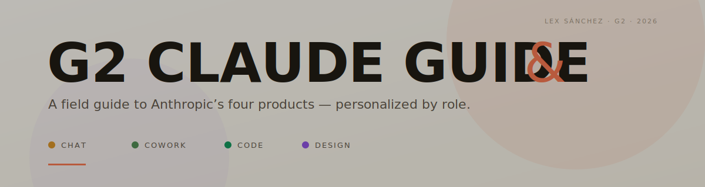

  

  <strong>The G2 field guide to Anthropic's four products.</strong> 
  Personalized by role — open it once, get a path tailored to your week.

  <a href="https://lsanchez-g2.github.io/g2-claude-guide/">
    <strong>→ View the guide</strong>
  </a>

---

## A guide that shapes itself to you

Open the page and a short three-step wizard asks who you are, what slows you down most, and where your work lives. From those answers it builds a **Your Path** card with everything you need on one screen:

- **A starting order** — which of the four Claudes to reach for first, second, third.
- **Three prompts you can paste in this week**, written for your role.
- **One playbook to run end-to-end** before you add the next.
- **Your top 10 skills to install** — mandatory items called out in ember.

You can change roles any time. The persona menu in the top right re-tailors the deep dives in every section.

## The four products, at a glance

| Product | Job | Where the work happens |
|---|---|---|
| **Claude Chat** | Think with it, draft with it, dashboard with it. | Conversation, Artifacts, connectors. |
| **Claude Cowork** | Files on your computer, organised by you-but-not-by-you. | Your desktop, with explicit folder access. |
| **Claude Code** | Ship the PR from a one-line goal. | Your terminal — CLI, MCP, subagents, hooks. |
| **Claude Design** | Mockups, decks, handoff bundles — all from one prompt. | A visual canvas with real exports (Canva, PPTX, PDF, HTML, Code handoff). |

Each section has an animated demo so you can see the product before you decide.

## Three playbooks that stitch the stack

The four Claudes are designed to compose. Three named routes are rendered as colour-coded subway maps inside the guide:

1. **Spec → Ship.** A PM's one-pager becomes a designer's prototype, becomes a build bundle, becomes a shipped PR.
2. **Inbox → Insight.** Cowork tidies a folder; Chat turns the result into a re-openable Live Artifact the team can check each Monday.
3. **Repo → Refactor.** Subagents map a legacy module; the findings become a one-pager and a leadership slide.

## Seven roles, seven paths

The wizard knows about **Designer**, **Product Manager**, **Engineer**, **Leadership**, **UX Researcher**, **Operator** (finance / ops / legal / sales / marketing / support), and a *Curious* catch-all. Pick yours and the whole guide reflows — product priority, prompts, playbook, skills.

## Light or dark, mobile or desktop

The guide opens in light mode with a toggle in the top nav for dark. It respects `prefers-color-scheme` for first-time visitors. It's fully responsive — the wizard, the matrix, and the four animated demos all collapse cleanly to one column on phones.

> [!IMPORTANT]
> **Need access?** Use the **G2 Assist Slackbot**. If it doesn't work, ping **@Johnny Trieu**.

## Skills you can take with you

The guide recommends ten skills per role, mixing official Anthropic skills with custom and third-party additions. The custom **ds-architect** skill is *mandatory* for designers and lives at [github.com/lsanchez-g2/ds-architect](https://github.com/lsanchez-g2/ds-architect). Two ready-to-install `SKILL.md` files are bundled in `skills-to-install/` for the impatient.

---

  <em>Lex Sánchez &middot; G2 &middot; Product Builder &middot; 2026</em>

